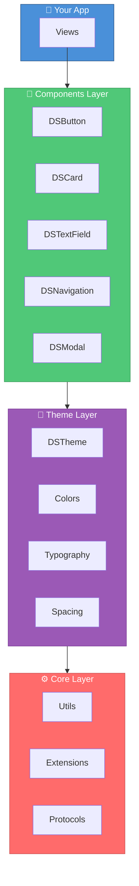
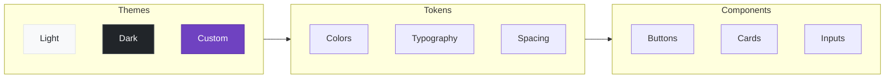

```

<p align="center">
  <a href="README.md">🇺🇸 English</a> |
  <a href="README_TR.md">🇹🇷 Türkçe</a>
</p>

╔════════════════════════════════════════════════════════════════════════════════════════════╗
║                                                                                            ║
║   ███████╗██╗    ██╗██╗███████╗████████╗██╗   ██╗██╗                                       ║
║   ██╔════╝██║    ██║██║██╔════╝╚══██╔══╝██║   ██║██║                                       ║
║   ███████╗██║ █╗ ██║██║█████╗     ██║   ██║   ██║██║                                       ║
║   ╚════██║██║███╗██║██║██╔══╝     ██║   ██║   ██║██║                                       ║
║   ███████║╚███╔███╔╝██║██║        ██║   ╚██████╔╝██║                                       ║
║   ╚══════╝ ╚══╝╚══╝ ╚═╝╚═╝        ╚═╝    ╚═════╝ ╚═╝                                       ║
║                                                                                            ║
║   ██████╗ ███████╗███████╗██╗ ██████╗ ███╗   ██╗    ███████╗██╗   ██╗███████╗████████╗    ║
║   ██╔══██╗██╔════╝██╔════╝██║██╔════╝ ████╗  ██║    ██╔════╝╚██╗ ██╔╝██╔════╝╚══██╔══╝    ║
║   ██║  ██║█████╗  ███████╗██║██║  ███╗██╔██╗ ██║    ███████╗ ╚████╔╝ ███████╗   ██║       ║
║   ██║  ██║██╔══╝  ╚════██║██║██║   ██║██║╚██╗██║    ╚════██║  ╚██╔╝  ╚════██║   ██║       ║
║   ██████╔╝███████╗███████║██║╚██████╔╝██║ ╚████║    ███████║   ██║   ███████║   ██║       ║
║   ╚═════╝ ╚══════╝╚══════╝╚═╝ ╚═════╝ ╚═╝  ╚═══╝    ╚══════╝   ╚═╝   ╚══════╝   ╚═╝       ║
║                                                                                            ║
║   ██████╗ ██████╗  ██████╗                                                                 ║
║   ██╔══██╗██╔══██╗██╔═══██╗   Enterprise-grade design system for SwiftUI applications     ║
║   ██████╔╝██████╔╝██║   ██║   Build beautiful, consistent, accessible apps at scale       ║
║   ██╔═══╝ ██╔══██╗██║   ██║                                                                ║
║   ██║     ██║  ██║╚██████╔╝                                                                ║
║   ╚═╝     ╚═╝  ╚═╝ ╚═════╝                                                                 ║
║                                                                                            ║
╚════════════════════════════════════════════════════════════════════════════════════════════╝
```

<div align="center">

**Production-ready design system with 15+ components, design tokens, and full accessibility support.**

[](https://swift.org)
[](https://developer.apple.com/ios/)
[](https://developer.apple.com/macos/)
[](https://swift.org/package-manager/)
[](LICENSE)
[](https://github.com/muhittincamdali/SwiftUI-Design-System-Pro/actions)
[](https://github.com/muhittincamdali/SwiftUI-Design-System-Pro)

[Features](#-features) • [Quick Start](#-quick-start) • [Components](#-components) • [Theming](#-theming) • [Docs](Documentation/)

</div>

---

## ✨ Features

- 🎨 **Design Tokens** — Consistent colors, typography, spacing, and shadows
- 🧩 **15+ Components** — Buttons, cards, inputs, navigation, modals, and more
- 🌓 **Dark Mode** — Automatic light/dark switching with custom theme support
- ♿ **Accessible** — VoiceOver, Dynamic Type, and reduced motion built-in
- 📱 **Responsive** — Adaptive layouts for iPhone, iPad, and Mac
- 🧪 **92% Tested** — Unit tests and snapshot tests included
- 📖 **DocC Docs** — Comprehensive documentation with examples

---

## 🏗️ Architecture



---

## 🚀 Quick Start

### Installation

```swift
// Package.swift
dependencies: [
    .package(url: "https://github.com/muhittincamdali/SwiftUI-Design-System-Pro.git", from: "1.0.0")
]
```

### Basic Usage

```swift
import SwiftUIDesignSystemPro

struct ContentView: View {
    @State private var email = ""
    @State private var isLoading = false
    
    var body: some View {
        VStack(spacing: DSSpacing.lg) {
            // Typography
            DSText("Welcome Back", style: .largeTitle)
            DSText("Sign in to continue", style: .body, color: .secondary)
            
            // Input
            DSTextField("Email", text: $email, icon: "envelope")
                .keyboardType(.emailAddress)
            
            // Button with loading state
            DSButton(title: "Sign In", style: .primary, isLoading: isLoading) {
                handleSignIn()
            }
            
            // Secondary action
            DSButton(title: "Create Account", style: .tertiary) {
                // Navigate to signup
            }
        }
        .padding(DSSpacing.xl)
    }
}
```

---

## 🧩 Components

| Component | Description | Styles |
|:---------:|-------------|--------|
| **DSButton** | Customizable button with loading states | `primary` `secondary` `tertiary` `destructive` |
| **DSCard** | Elevated container with shadows | `flat` `elevated` `outlined` |
| **DSTextField** | Text input with validation | `default` `error` `success` |
| **DSNavigationBar** | Custom navigation header | `standard` `large` `transparent` |
| **DSTabBar** | Bottom tab navigation | `filled` `outlined` |
| **DSModal** | Sheets and dialogs | `sheet` `fullscreen` `dialog` |
| **DSAlert** | Toast notifications | `success` `warning` `error` `info` |
| **DSProgressIndicator** | Loading states | `circular` `linear` `dots` |
| **DSSearchField** | Search with suggestions | `default` `minimal` |
| **DSChart** | Data visualization | `bar` `line` `pie` |
| **DSBadge** | Status indicators | `solid` `outlined` `dot` |

---

## 🎨 Design Tokens

### Colors

```swift
DSColors.primary          // Brand primary
DSColors.secondary        // Brand secondary
DSColors.background       // Page background
DSColors.surface          // Card/component surface
DSColors.text             // Primary text
DSColors.textSecondary    // Secondary text
DSColors.success          // Success states
DSColors.warning          // Warning states
DSColors.error            // Error states
```

### Typography

```swift
DSText("Display",     style: .display)      // 48pt Bold
DSText("Large Title", style: .largeTitle)   // 34pt Bold
DSText("Title 1",     style: .title1)       // 28pt Bold
DSText("Title 2",     style: .title2)       // 22pt Semibold
DSText("Headline",    style: .headline)     // 17pt Semibold
DSText("Body",        style: .body)         // 17pt Regular
DSText("Caption",     style: .caption)      // 12pt Regular
```

### Spacing Scale

```
DSSpacing.xxs   │  2pt   │  ██
DSSpacing.xs    │  4pt   │  ████
DSSpacing.sm    │  8pt   │  ████████
DSSpacing.md    │  16pt  │  ████████████████
DSSpacing.lg    │  24pt  │  ████████████████████████
DSSpacing.xl    │  32pt  │  ████████████████████████████████
DSSpacing.xxl   │  48pt  │  ████████████████████████████████████████
```

---

## 🌓 Theming



### Custom Theme

```swift
struct BrandTheme: DSThemeProtocol {
    var colors: DSThemeColors {
        DSThemeColors(
            primary: Color("BrandBlue"),
            secondary: Color("BrandPurple"),
            background: Color("BrandBackground"),
            surface: Color("BrandSurface"),
            text: Color("BrandText")
        )
    }
}

// Apply globally
DSTheme.shared.apply(BrandTheme())
```

---

## 📁 Project Structure

```
SwiftUI-Design-System-Pro/
├── 📂 Sources/
│   ├── Core/           # Foundation components
│   ├── Components/     # UI Components
│   ├── Theme/          # Design Tokens
│   └── Utils/          # Utilities
├── 📂 Examples/        # Sample Apps
├── 📂 Tests/           # Test Suite
└── 📂 Documentation/   # DocC Docs
```

---

## 📋 Requirements

| Requirement | Version |
|-------------|---------|
| iOS | 15.0+ |
| macOS | 12.0+ |
| watchOS | 8.0+ |
| tvOS | 15.0+ |
| Swift | 5.9+ |
| Xcode | 15.0+ |

---

## 📖 Documentation

| Guide | Description |
|-------|-------------|
| [Getting Started](Documentation/GettingStarted.md) | Installation and setup |
| [Design Tokens](Documentation/DesignTokens.md) | Colors, typography, spacing |
| [Components](Documentation/Components.md) | Component reference |
| [Theming](Documentation/Theming.md) | Custom themes |
| [Accessibility](Documentation/Accessibility.md) | A11y best practices |

---

## 🤝 Contributing

Contributions are welcome! Please read our [Contributing Guide](CONTRIBUTING.md).

```bash
git checkout -b feature/amazing-component
swift test
git commit -m "feat(components): add amazing component"
git push origin feature/amazing-component
```

---

## 📄 License

MIT License — see [LICENSE](LICENSE) for details.

---

<div align="center">

## 👨‍💻 Author

**Muhittin Camdali**

[](https://github.com/muhittincamdali)
[](https://linkedin.com/in/muhittincamdali)

---

**⭐ Star this repo if you find it useful!**

*"Good design is obvious. Great design is transparent."* — Joe Sparano

</div>
