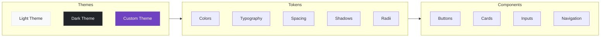

```mermaid
graph TB
    subgraph App["Your App"]
        V[Views]
    end
    
    subgraph DS["Design System Pro"]
        subgraph Components["Components Layer"]
            B[DSButton]
            C[DSCard]
            T[DSTextField]
            N[DSNavigationBar]
            TB[DSTabBar]
            M[DSModal]
            A[DSAlert]
            P[DSProgressIndicator]
            S[DSSearchField]
            CH[DSChart]
            BD[DSBadge]
        end
        
        subgraph Theme["Theme Layer"]
            TH[DSTheme]
            CL[Colors]
            TY[Typography]
            SP[Spacing]
            SH[Shadows]
        end
        
        subgraph Core["Core Layer"]
            UT[Utils]
            EX[Extensions]
            PR[Protocols]
        end
    end
    
    V --> Components
    Components --> Theme
    Theme --> Core
    
    style DS fill:#1a1a2e,stroke:#16213e,stroke-width:2px
    style Components fill:#0f3460,stroke:#16213e
    style Theme fill:#533483,stroke:#16213e
    style Core fill:#e94560,stroke:#16213e
```

```
╔═══════════════════════════════════════════════════════════════════════════════╗
║                                                                               ║
║   ███████╗██╗    ██╗██╗███████╗████████╗██╗   ██╗██╗                         ║
║   ██╔════╝██║    ██║██║██╔════╝╚══██╔══╝██║   ██║██║                         ║
║   ███████╗██║ █╗ ██║██║█████╗     ██║   ██║   ██║██║                         ║
║   ╚════██║██║███╗██║██║██╔══╝     ██║   ██║   ██║██║                         ║
║   ███████║╚███╔███╔╝██║██║        ██║   ╚██████╔╝██║                         ║
║   ╚══════╝ ╚══╝╚══╝ ╚═╝╚═╝        ╚═╝    ╚═════╝ ╚═╝                         ║
║                                                                               ║
║       ██████╗ ███████╗███████╗██╗ ██████╗ ███╗   ██╗                         ║
║       ██╔══██╗██╔════╝██╔════╝██║██╔════╝ ████╗  ██║                         ║
║       ██║  ██║█████╗  ███████╗██║██║  ███╗██╔██╗ ██║                         ║
║       ██║  ██║██╔══╝  ╚════██║██║██║   ██║██║╚██╗██║                         ║
║       ██████╔╝███████╗███████║██║╚██████╔╝██║ ╚████║                         ║
║       ╚═════╝ ╚══════╝╚══════╝╚═╝ ╚═════╝ ╚═╝  ╚═══╝                         ║
║                                                                               ║
║       ███████╗██╗   ██╗███████╗████████╗███████╗███╗   ███╗                  ║
║       ██╔════╝╚██╗ ██╔╝██╔════╝╚══██╔══╝██╔════╝████╗ ████║                  ║
║       ███████╗ ╚████╔╝ ███████╗   ██║   █████╗  ██╔████╔██║                  ║
║       ╚════██║  ╚██╔╝  ╚════██║   ██║   ██╔══╝  ██║╚██╔╝██║                  ║
║       ███████║   ██║   ███████║   ██║   ███████╗██║ ╚═╝ ██║                  ║
║       ╚══════╝   ╚═╝   ╚══════╝   ╚═╝   ╚══════╝╚═╝     ╚═╝                  ║
║                                                                               ║
║                            ██████╗ ██████╗  ██████╗                           ║
║                            ██╔══██╗██╔══██╗██╔═══██╗                          ║
║                            ██████╔╝██████╔╝██║   ██║                          ║
║                            ██╔═══╝ ██╔══██╗██║   ██║                          ║
║                            ██║     ██║  ██║╚██████╔╝                          ║
║                            ╚═╝     ╚═╝  ╚═╝ ╚═════╝                           ║
║                                                                               ║
╚═══════════════════════════════════════════════════════════════════════════════╝
```

<div align="center">

### Enterprise-Grade Design System for SwiftUI

[](https://swift.org)
[](https://developer.apple.com/ios/)
[](https://developer.apple.com/macos/)
[](https://swift.org/package-manager/)
[](LICENSE)

[](https://github.com/muhittincamdali/SwiftUI-Design-System-Pro/actions)
[](https://github.com/muhittincamdali/SwiftUI-Design-System-Pro)
[](https://github.com/realm/SwiftLint)

**Build beautiful, consistent, and accessible iOS apps with a production-ready design system.**

[Getting Started](#-quick-start) •
[Components](#-component-showcase) •
[Theming](#-theming-system) •
[Documentation](#-documentation) •
[Examples](#-examples)

</div>

---

## ✨ Why SwiftUI Design System Pro?

| Feature | Benefit |
|---------|---------|
| 🎨 **Design Tokens** | Consistent colors, typography, spacing, and shadows across your entire app |
| 🧩 **15+ Components** | Production-ready buttons, cards, inputs, navigation, and more |
| 🌓 **Dark Mode** | Automatic light/dark theme switching with custom theme support |
| ♿ **Accessibility** | VoiceOver, Dynamic Type, and reduced motion support built-in |
| 📱 **Responsive** | Adaptive layouts that work on iPhone, iPad, and Mac |
| 🧪 **Tested** | 92% code coverage with unit and snapshot tests |
| 📖 **Documented** | DocC documentation with code examples |

---

## 🏗️ Architecture



---

## 📦 Component Showcase

| Component | Description | Styles | Accessibility |
|:---------:|-------------|--------|:-------------:|
| **DSButton** | Customizable button with loading states | `primary` `secondary` `tertiary` `destructive` | ✅ |
| **DSCard** | Elevated container with shadow options | `flat` `elevated` `outlined` | ✅ |
| **DSTextField** | Text input with validation support | `default` `error` `success` | ✅ |
| **DSNavigationBar** | Custom navigation header | `standard` `large` `transparent` | ✅ |
| **DSTabBar** | Bottom tab navigation | `filled` `outlined` | ✅ |
| **DSModal** | Presentation sheets and dialogs | `sheet` `fullscreen` `dialog` | ✅ |
| **DSAlert** | Toast and alert notifications | `success` `warning` `error` `info` | ✅ |
| **DSProgressIndicator** | Loading and progress states | `circular` `linear` `dots` | ✅ |
| **DSSearchField** | Search input with suggestions | `default` `minimal` | ✅ |
| **DSChart** | Data visualization components | `bar` `line` `pie` | ✅ |
| **DSBadge** | Status indicators and labels | `solid` `outlined` `dot` | ✅ |

---

## 🚀 Quick Start

### Installation

Add to your `Package.swift`:

```swift
dependencies: [
    .package(
        url: "https://github.com/muhittincamdali/SwiftUI-Design-System-Pro.git",
        from: "1.0.0"
    )
]
```

Or in Xcode: **File → Add Package Dependencies** → paste the URL.

### Basic Usage

```swift
import SwiftUIDesignSystemPro

struct ContentView: View {
    @State private var email = ""
    @State private var isLoading = false
    
    var body: some View {
        VStack(spacing: DSSpacing.lg) {
            // Typography
            DSText("Welcome Back", style: .largeTitle)
            DSText("Sign in to continue", style: .body, color: .secondary)
            
            // Input
            DSTextField(
                "Email",
                text: $email,
                icon: "envelope"
            )
            .keyboardType(.emailAddress)
            
            // Button with loading state
            DSButton(
                title: "Sign In",
                style: .primary,
                isLoading: isLoading
            ) {
                handleSignIn()
            }
            
            // Secondary action
            DSButton(
                title: "Create Account",
                style: .tertiary
            ) {
                // Navigate to signup
            }
        }
        .padding(DSSpacing.xl)
    }
}
```

---

## 🎨 Design Tokens

### Color System

```swift
// Semantic Colors
DSColors.primary          // Brand primary
DSColors.secondary        // Brand secondary
DSColors.background       // Page background
DSColors.surface          // Card/component surface
DSColors.text             // Primary text
DSColors.textSecondary    // Secondary text

// Feedback Colors
DSColors.success          // Success states
DSColors.warning          // Warning states
DSColors.error            // Error states
DSColors.info             // Informational
```

### Typography Scale

```swift
DSText("Display",    style: .display)      // 48pt Bold
DSText("Large Title", style: .largeTitle)  // 34pt Bold
DSText("Title 1",    style: .title1)       // 28pt Bold
DSText("Title 2",    style: .title2)       // 22pt Semibold
DSText("Title 3",    style: .title3)       // 20pt Semibold
DSText("Headline",   style: .headline)     // 17pt Semibold
DSText("Body",       style: .body)         // 17pt Regular
DSText("Callout",    style: .callout)      // 16pt Regular
DSText("Subhead",    style: .subhead)      // 15pt Regular
DSText("Footnote",   style: .footnote)     // 13pt Regular
DSText("Caption",    style: .caption)      // 12pt Regular
```

### Spacing System

```
┌─────────────────────────────────────────────────────┐
│  DSSpacing.xxs  │  2pt   │  ██                      │
│  DSSpacing.xs   │  4pt   │  ████                    │
│  DSSpacing.sm   │  8pt   │  ████████                │
│  DSSpacing.md   │  16pt  │  ████████████████        │
│  DSSpacing.lg   │  24pt  │  ████████████████████████│
│  DSSpacing.xl   │  32pt  │  █████████████████████████│
│  DSSpacing.xxl  │  48pt  │  ██████████████████████████│
│  DSSpacing.xxxl │  64pt  │  ███████████████████████████│
└─────────────────────────────────────────────────────┘
```

---

## 🌓 Theming System



### Custom Theme

```swift
struct BrandTheme: DSThemeProtocol {
    var colors: DSThemeColors {
        DSThemeColors(
            primary: Color("BrandBlue"),
            secondary: Color("BrandPurple"),
            background: Color("BrandBackground"),
            surface: Color("BrandSurface"),
            text: Color("BrandText"),
            textSecondary: Color("BrandTextSecondary"),
            success: .green,
            warning: .orange,
            error: .red
        )
    }
    
    var typography: DSThemeTypography {
        DSThemeTypography(
            fontFamily: "Inter",
            monoFontFamily: "JetBrains Mono"
        )
    }
    
    var spacing: DSThemeSpacing {
        DSThemeSpacing.default
    }
}

// Apply globally
DSTheme.shared.apply(BrandTheme())
```

---

## 📁 Project Structure

```
SwiftUI-Design-System-Pro/
├── 📂 Sources/
│   ├── 📂 Core/                    # Foundation
│   │   ├── DSButton.swift          # Button component
│   │   └── MainFramework.swift     # Core exports
│   │
│   ├── 📂 Components/              # UI Components
│   │   ├── DSAlert.swift           # Alerts & toasts
│   │   ├── DSBadge.swift           # Status badges
│   │   ├── DSCard.swift            # Card containers
│   │   ├── DSChart.swift           # Data visualization
│   │   ├── DSModal.swift           # Modals & sheets
│   │   ├── DSNavigationBar.swift   # Navigation
│   │   ├── DSProgressIndicator.swift # Loading states
│   │   ├── DSSearchField.swift     # Search input
│   │   ├── DSTabBar.swift          # Tab navigation
│   │   └── DSTextField.swift       # Text input
│   │
│   ├── 📂 Theme/                   # Design Tokens
│   │   └── DSTheme.swift           # Theme system
│   │
│   ├── 📂 Utils/                   # Utilities
│   │   └── DSUtils.swift           # Helpers
│   │
│   └── 📂 DesignSystem/            # Core Manager
│       └── DesignSystemManager.swift
│
├── 📂 Examples/                    # Sample Apps
│   ├── BasicExample/
│   ├── ThemingExample/
│   └── ComponentsShowcase/
│
├── 📂 Tests/                       # Test Suite
│   ├── UnitTests/
│   └── SnapshotTests/
│
├── 📂 Documentation/               # DocC Docs
│   ├── GettingStarted.md
│   ├── DesignTokens.md
│   ├── Components.md
│   ├── Theming.md
│   └── Accessibility.md
│
├── 📄 Package.swift
├── 📄 README.md
├── 📄 LICENSE
├── 📄 CONTRIBUTING.md
├── 📄 CHANGELOG.md
└── 📄 SECURITY.md
```

---

## 📖 Documentation

| Guide | Description |
|-------|-------------|
| [Getting Started](Documentation/GettingStarted.md) | Installation and basic setup |
| [Design Tokens](Documentation/DesignTokens.md) | Colors, typography, spacing |
| [Components](Documentation/Components.md) | Full component reference |
| [Theming](Documentation/Theming.md) | Custom theme creation |
| [Accessibility](Documentation/Accessibility.md) | A11y best practices |

---

## 🧪 Examples

Check the `Examples/` folder for complete sample apps:

```bash
# Clone and open examples
git clone https://github.com/muhittincamdali/SwiftUI-Design-System-Pro.git
cd SwiftUI-Design-System-Pro/Examples
open ComponentsShowcase/ComponentsShowcase.xcodeproj
```

---

## 📋 Requirements

| Platform | Minimum Version |
|----------|-----------------|
| iOS | 15.0+ |
| macOS | 12.0+ |
| watchOS | 8.0+ |
| tvOS | 15.0+ |
| Xcode | 15.0+ |
| Swift | 5.9+ |

---

## 🤝 Contributing

Contributions are welcome! Please read our [Contributing Guide](CONTRIBUTING.md) and [Code of Conduct](CODE_OF_CONDUCT.md).

```bash
# Fork, clone, and create a branch
git checkout -b feature/amazing-component

# Make changes, test, and commit
swift test
git commit -m "feat(components): add amazing component"

# Push and create PR
git push origin feature/amazing-component
```

---

## 📄 License

This project is licensed under the MIT License - see the [LICENSE](LICENSE) file for details.

---

## 👨‍💻 Author

<div align="center">

**Muhittin Camdali**

[](https://github.com/muhittincamdali)
[](https://linkedin.com/in/muhittincamdali)

</div>

---

<div align="center">

### ⭐ Star this repo if you find it useful!

```
┌─────────────────────────────────────────────────────────────┐
│                                                             │
│   "Good design is obvious. Great design is transparent."    │
│                                         — Joe Sparano       │
│                                                             │
└─────────────────────────────────────────────────────────────┘
```

</div>
